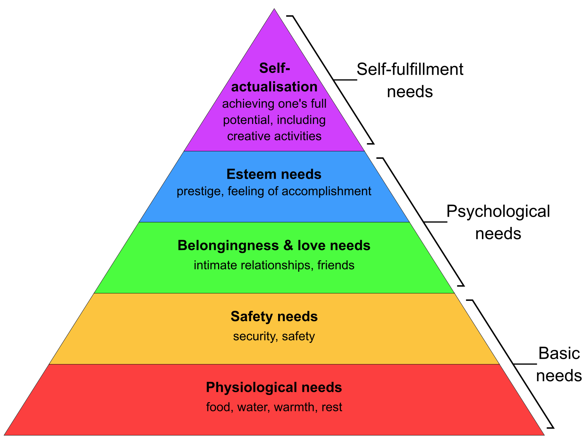

{/* Reason to exist, as short as possible. Max 1 section */}

Current game AI is more often than not a checklist that settles on specific behaviors. While this may be easy to debug, it fundamentally does not follow a fluid thought process, easily resulting in robotic behavior. Also, reusing these imperative decision trees can be daunting, as they strongly couple AI with gameplay. With this system, I aim to address these issues through a [Maslow pyramid](https://en.wikipedia.org/wiki/Maslow%27s_hierarchy_of_needs)-inspired declarative infrastructure that is performant, easy to use and to debug.



## Design

{/* Description, target and explanation of the design. Split in max 2 sections if too long, divided by a media */}

Act by belief is an extension of decision trees designed for natural behavior. It is especially useful for complex organic agents that follow reactive thought processes. For robotic or immutable behavior, traditional methods would be preferable. In this system, an agent is split into brain and body.

### Brain

The brain is the belief processor and the agent's personality.

```csharp
var brain = new Brain(body);
```

A brain can believe in signals captured by its sensors, or have beliefs of its own.

```csharp
Belief<Vector3> Position = new();

// Update belief
Position.Sense(transform.position);
```

Beliefs can also interpret signals from sensors or existing beliefs. Signals contain data circulating in the brain and assure only beliefs that need to be updated are processed.

```csharp
// Senses a transform, holds a vector
Belief<Transform, Vector3> PlayerPosition = new(signal => signal.sensed.position);

PlayerPosition.Sense(player.transform);
```

But most importantly, a brain has needs that it wants to fulfill. Need beliefs are special beliefs that estimate the urgency of a need from 0 to 1, given the current signal. Also, the `Need` static class contains helper functions for frequent estimates.

```csharp
// The AI needs to kiss the player more and more as the player gets near
var kissPlayer = brain.Need(
    new(signal => Need.Near(signal.Get(Position), signal.Get(PlayerPosition))),
    // Needs to kiss out of love
    Motive.Love
);
```

The motive of a need can be survival, love, or achievement, in order of importance following Maslow's pyramid. It acts as a weight, used to compare needs. Finally, these needs are used to evaluate output beliefs, read by the body to execute actions.

```csharp
Belief<Vector3> TargetPosition;

// If needs to kiss, target is player
// Else stand still
TargetPosition = new(
    signal =>
        signal.Get(kissPlayer) > Need.ABSENT
            ? signal.Get(PlayerPosition)
            : signal.Get(Position)
);
```

### Body

Beliefs that always represent reality can be moved to the body.

```csharp
// Can be moved from brain to body
Belief<Vector3> Position = new();

// Add brain reference
var brain = new AI(this);
```

At last, a body acts upon the output beliefs of the brain.

```csharp
var targetPath = brain.TargetPosition.Value - Position.Value;

// Kiss if in range, else move toward target
if(targetPath.magnitude < 1)
    Kiss();
else
    controller.Move(movementSpeed * targetPath.normalized);
```

{/* First point: ux, second point: code, third point: development challenges. Split in max 4 points if too long */}

* The system comes with a simple and fully documented API and in-game debugger, limiting its usage to Unity programmers. The debugger displays a text overlay with the quasi-realtime beliefs of every brain, and brain IDs on top of their bodies. A simple code demonstration of basic functionality is also provided.
* The codebase is compact, amounting to a total of around 1500 lines including documentation. The API was designed for a smooth developer experience and ease of editing.
* The biggest development challenge was C#'s type system, forcing me to introduce some slow reflection. To save on performance, I plan to migrate this system to a C++ library in the near future.