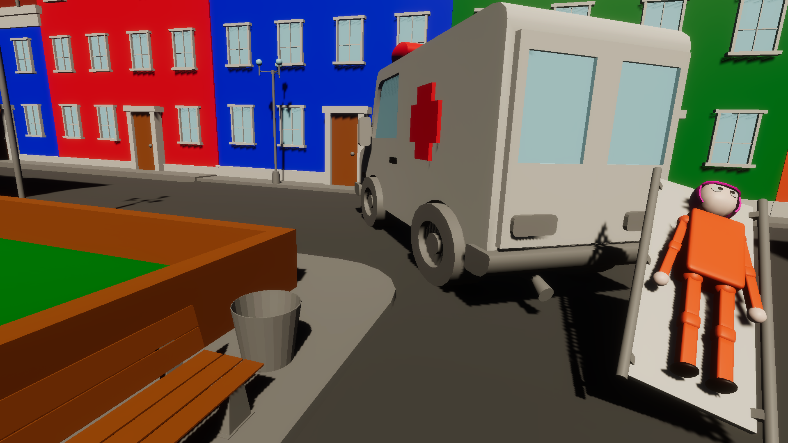

{/* Description of the game, as short as possible. Max 1 section */}

The task is clear: take patients to the hospital before their situation becomes critical. Simple enough, if not for your unruly vehicle. Try (not) to hit pedestrians while you master the least accurate ambulance simulator ever.

## Design

{/* Genre, target, and goal of the design. Split in max 2 sections if too long, divided by a media */}

This prototype is a silly driving game where an out of control ambulance saves lives while inadvertently running over pedestrians. It's made for fans of ridiculous games, where wack physics allow for funny slapstick gameplay. Ambulance was made for a game jam with the theme "unfortunately, you're the bad guy". We wanted to create a simple experience with potential for hilarious moments.

{/* First point: character, second point: world, third point: development challenges. Split in max 4 points if too long */}

- The ambulance has unstable handling and collisions, feeling intuitive but physically exaggerated. Also, we left in hidden exploitable bugs, like flying, for comedic purposes.
- The map, pedestrians, and patient positions are procedurally generated, enabling some replayability value.
- The biggest challenge of this prototype was giving the player just the right amount of control over the vehicle. I underestimated this effort and had to discard features to focus on the core gameplay.
