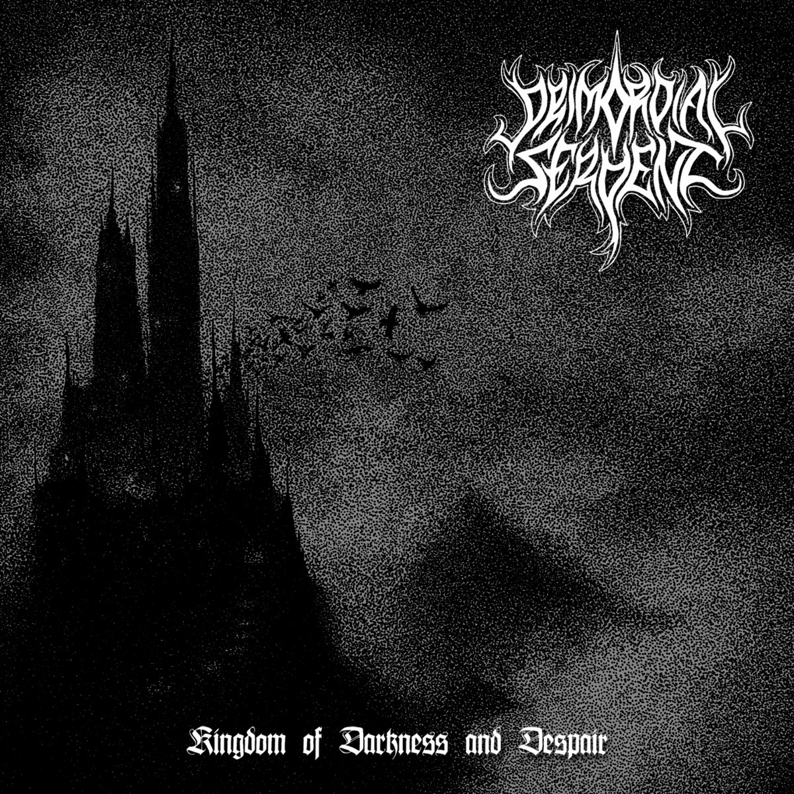
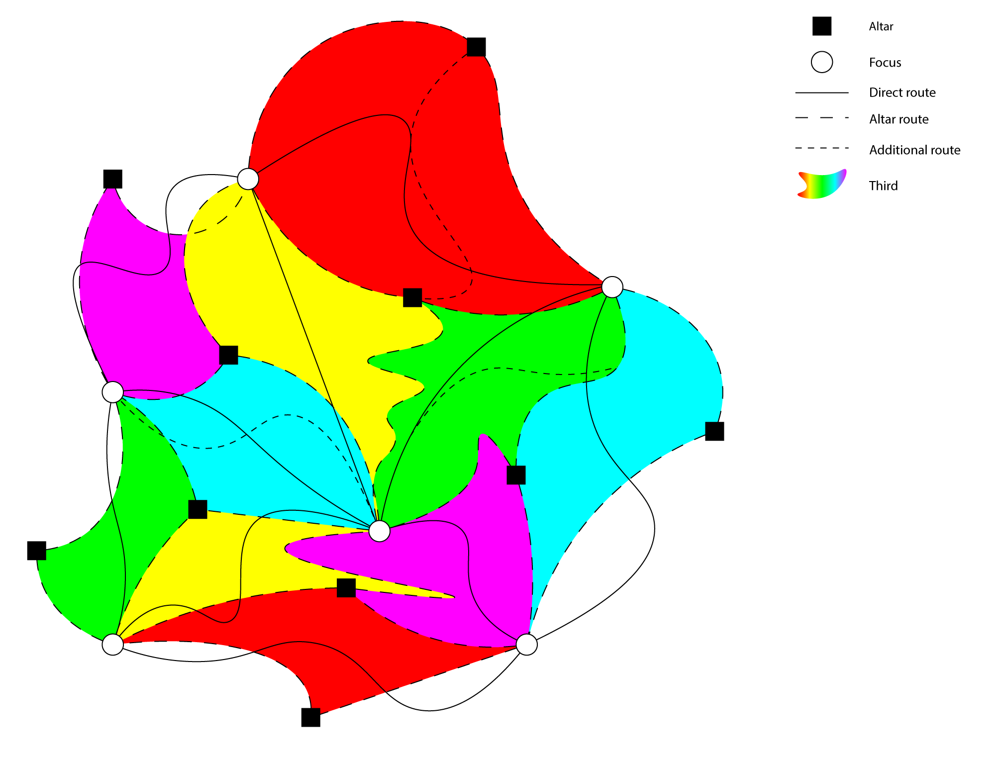

{/* Description of the game, as short as possible. Max 1 section */}

In a gothic industrial earth, people believe that detachment from reality brings their soul closer to an iris-like god. Every 111 years believers corrupt their bodies, claim three powerful soul-bound artifacts, and face a bloody ritual for a fourth one.

## Design

{/* Genre, target, and goal of the design. Split in max 2 sections if too long, divided by a media */}

Iris is a competitive horror game inspired by black metal where players hunt each other while collecting powers for their monstrous characters. It's a game aimed toward horror fans and competitive players alike with e-sports ambitions. The goal of the game is to scare players with the unpredictability of human enemies and keep the game balanced and skill based enough for flow to flourish.

{/* First point: character, second point: world, third point: development challenges. Split in max 4 points if too long */}

- Characters have a complex movement system made for intuitive platforming. Their goal is to win online 1v1 matches by hunting and grabbing other players, in order to collect artifacts and their relative powers (jumping on walls, invisibility, ...).
- Maps are made up of three points of interest where characters can claim collected artifacts to aid their goal, and a central altar where they can obtain a brand new artifact for their collection. Individual maps are conjoined to form a bigger game world where the lore and story of the game takes place.
- We dedicated a long time to designing and prototyping the platforming, given the unique challenges we were facing when balancing stealth and movement. Also, we took extra care to analyze how to create the perfect map system that would fit our scope and not bore players.
