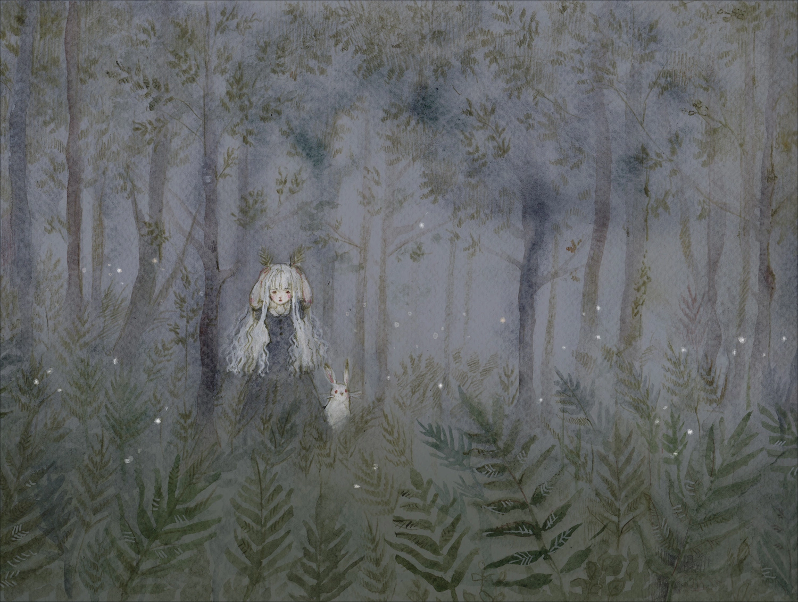

I developed Lolita specifically to improve my immersive design, AI and narrative skills. The concepting phase was a collaborative effort with former classmates that are artistically inclined. We gathered reference art and wrote down both the story of the character and the ideal gameplay. To challenge ourselves with a unique design, we envisioned our target audience to be a more artsy group of people, interested in the story and the artstyle more than the fun in itself. Although the focus of the game is elsewhere, this definitely would not make up an excuse for poor game design.

## Game

Lolita is inspired by the [book of the same name](https://wikipedia.org/wiki/Lolita). In the game, a little girl living in a village near a forest gets unjustly shamed by her patriarchal community, and runs away into the woods. As she wonders among the never ending trees, she will be protected by a mysterious presence, that grants her the power to turn into various animals that she befriends. Initially, the game encourages the player not to kill anyone, and instead avoid combat altogether. This premise will eventually turn out to be false, and the player will always have a choice to avenge themselves with violence.

## Game design

The challenge of the gameplay was to design skills that could be used for both stealth and action, and communicate a feeling of fear and inferiority in stealth situations, while expressing power in action. I figured having skills as potentially involuntary actions could create tension for the player, where every step must be calculated precisely in order to avoid triggering skills. The game also starts out by encouraging stealth gameplay, in order to express a feeling of restraint, in accordance with the story of a young innocent girl that gradually becomes a powerful evil being. As the game progresses, new skills are acquired and the gameplay naturally evolves into action, as being caught is not as punishing.

In this case, all documents were made to sell the script and game idea to possible colleagues and stakeholders. Therefore, the GDD is more focused on getting the concept and feeling of the ideal player across. It has some degree of technicality, but specifics are rather viewed through the prototype, than through the document. Thought boards have been set up to develop a unique art style and connect the whole vision together.

## Notable contributions

* Since the AI and level design are a huge part of the game, I automated most of the behavior of enemies and level design elements, to allow for quick iterations. To make the AI as intuitive as possible, I created tweakable behavior, that mimics human perception as close as possible.
* Since the character transforms in animals when using skills, I created a transformation system to give each animal a unique feeling, thus creating navigation minigames by changing controls and perspectives.
* To maximize immersion, the concept of the game requires every sound and UI element to be placed in the world (diegetic). In this way, the player can feel fully immersed in the magical forest that the game focuses on.
