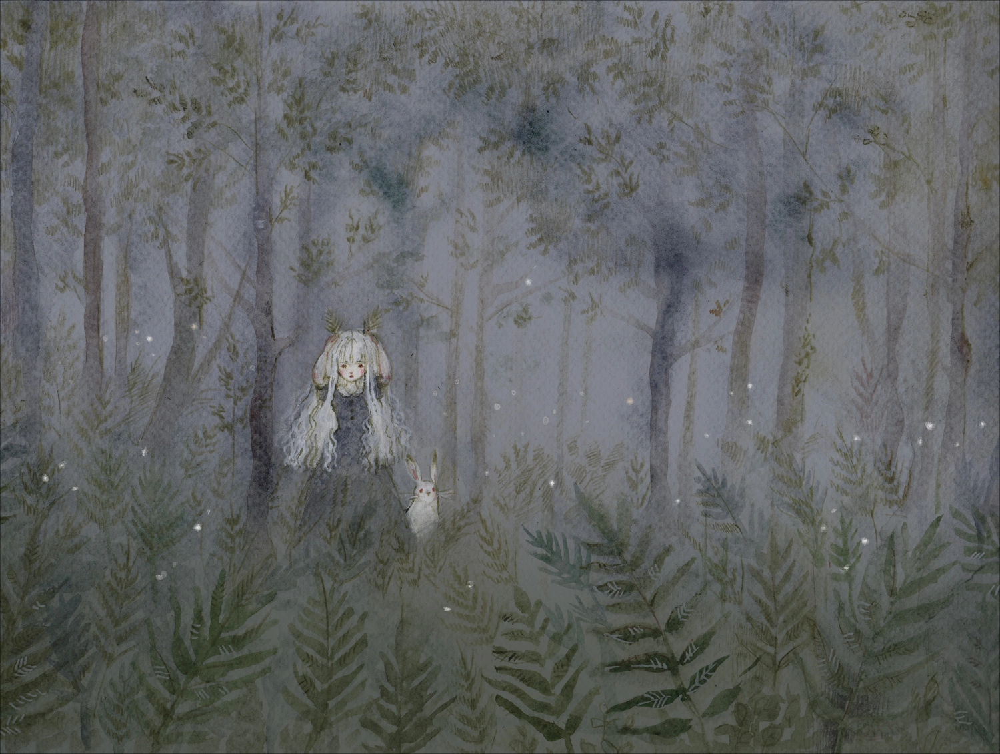

{/* Description of the game, as short as possible */}

A little girl living in a village is unjustly punished by her patriarchal community, and runs away into the nearby woods. As she wanders through the never ending trees, she will be protected by a dark mysterious entity, that grants her the power to turn into the fantastical animals she encounters along the way. Struggling to resist her instincts, she will turn more and more from a frightened human to a vengeful beast.

## Design

{/* Genre, target and goal of the design */}

Lolita is a narrative stealth-action hybrid, where the character can transform into a multitude of animals. I wanted to challenge myself by designing for a target audience interested in the cinematic aspects rather than the fun of the experience. Moreover, the game was an opportunity to improve my immersive design, worldbuilding, and narrative skills.

{/* First point: character, second point: world. Split if too long, in max 4 points */}

* The game starts out encouraging stealth gameplay, but reduces punishment for being aggressive as the character becomes more powerful, to reflect her evolution. The challenge of the design was to come up with elegant skills useful for both styles. For example, the ghost butterfly makes the character pass through objects and be invisible, but can also be used to pass through enemies and attack them from behind.
* Lolita's skills are her transformations, each with its unique controls and camera. The triggers of these skills are potentially involuntary actions to simulate the feeling of fighting one's instincts, for example staring for too long at enemies, or pressing the run button. At the beginning of the game, you fight the controls; but as the story goes on, you learn how to use them offensively.
* To make countering the AI as intuitive as possible, I created easily tweakable behavior that mimics human perception. Also, every sound and UI element is placed in the world, so that the player can fully immerse in the game's magical forest.