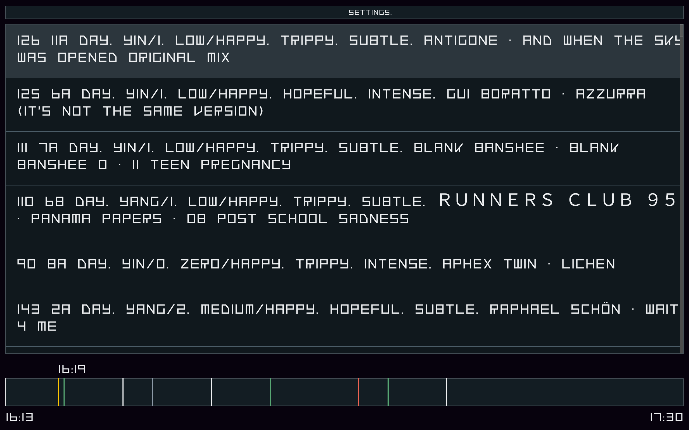
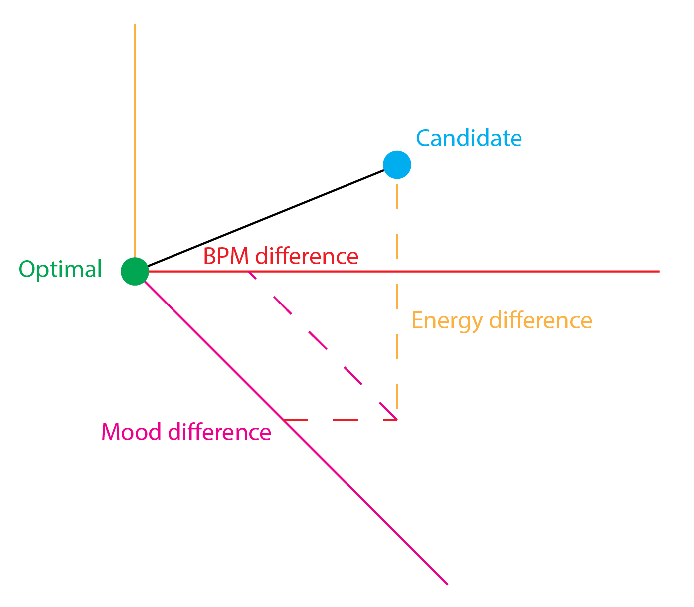
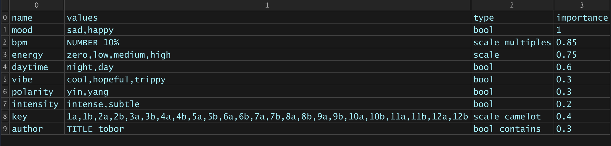

{/* Reason to exist, as short as possible. Max 1 section */}

While working on a scheduler for sales appointments, I came up with a recommender system driven by both objective and subjective parameters. Since I make electronic music, I figured I could use the same algorithm to drive my videogamey audiovisual live performances.

## Design

{/* Description, target and explanation of the design. Split in max 2 sections if too long, divided by a media */}

MARINETTI is an art-directable reccommender system for branching audiovisual narratives. The narrative is divided into sections tagged with their respective moods and attributes. The system recommends songs based on the playing audiovisual attributes, also handling transitions if the selected candidate is too different.

The recommender system can follow both objective and opinionated or artistic parameters. It can be used generically where more art-driven reccommendations are desired, e.g. AI. This differs from content-based filtering systems, where reccommendations are user driven.

{/* First point: ux, second point: code, third point: development challenges. Split in max 4 points if too long */}

- The system is easily customizable with standardized data types and modifiers. It also integrates tightly with TouchDesigner.
- I developed the code for the system in Python and Typescript. It is composed of a matching engine and candidate evaluators. It's fully declarative, able to read parameters from files and to override any optimal or candidate parameter dynamically in time.
- In these kind of systems, the biggest challenge is always to get the weights right, which heavily depend on defining the right parameters in the first place. Within some hours of testing, I managed to get the system to offer the best human-picked options as first or second option in the worst case, also handling transitions when optimal and best candidate differ too much.
