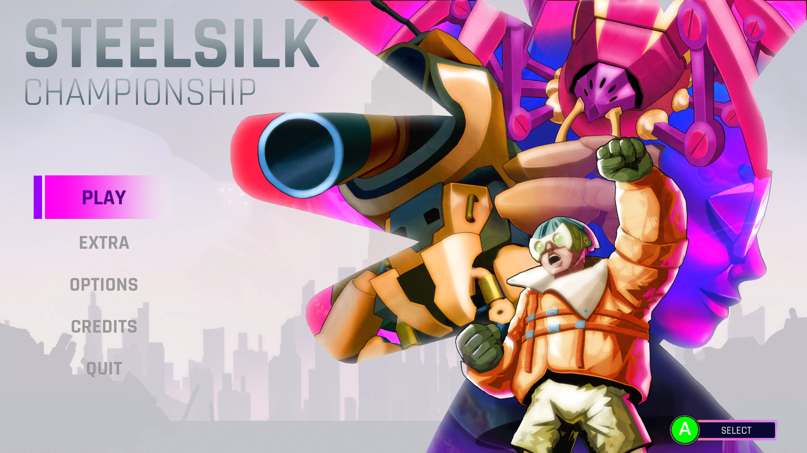

{/* Description of the game, as short as possible. Max 1 section */}

In the year 2980, a much anticipated robotics competition takes place: a team of miniature remote-control arachnoids fend off the creepy crawlies of three different biomes. Before each round, enemies receive a random bonus, and each spider has to choose a bonus for itself. To win, the team must counter enemies, make good use of each character's unique strengths, and form a solid strategy.

![EAGER Concept art by the incredible [Francesco Chiari(https://www.artstation.com/wdys)].](./steelsilk-championship-art.jpg)

## Design

{/* Genre, target, and goal of the design. Split in max 2 sections if too long, divided by a media */}

Steelsilk Championship is a couch co-op rougelite hero shoot 'em up with three arenas. The game was outlined by my game development school, then passed onto my classmates and me to develop further. We imagined a target audience interested in small catchy games, where people could team up with their friends or achieve a quick solo flow state.

Our goal was to create a genre game that favored positive interactions among players, theorycrafting and replayability. At the same time, we sacrificed design focus and faster development times in favor of deepening our skillsets.

{/* First point: character, second point: world, third point: development challenges. Split in max 4 points if too long */}

* The game was originally thought out for 4 players, but we scaled the number of characters down to 2, while allowing 1 to 4 players. I designed the two heroes to have opposite playstyles that relied on each other to truly shine. For example, one spider specializes in areas of effect, but only the other spider is fast enough to herd enemies, making interplay a necessity.
* Spawned enemies change based on the biome and have different movesets that must be countered by the most effective character. Arenas are progressively harder, and enemy spawn rates increase as the stage timer reaches zero and players have to take refuge in an underground elevator.
* In the elevator, enemies receive a random bonus and players must choose a bonus among three, before the next stage begins. Bonuses have a rarity system, with the rarest ones completely changing a hero's playstyle. After three stages, players view a leaderboard and can decide to restart to beat their score.
* Given the lack of details of the original concept document, the biggest challenge was team alignment with the GDD, which I had to write during production. It came to me that we could use the GDD to also track work, by coloring text that was WIP or completed. This greatly increased speed, quality, and morale, since the team became more involved in the big picture.